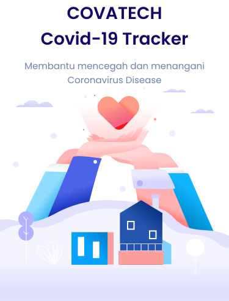

<!-- PROJECT LOGO -->
 

  

  <h3 align="center">COVATECH</h3>

  

    Membantu Mencegah dan Menangani Corovirus Disease
     
    <a href="https://github.com/ilhamfzri/CovaTech"><strong>Explore the docs »</strong></a>
     
     
    <a href="https://github.com/ilhamfzri/CovaTech">View Demo</a>
    .
    <a href="https://github.com/ilhamfzri/CovaTech>Report Bug</a>
    ·
    <a href="https://github.com/ilhamfzri/CovaTech">Request Feature</a>
  

 

<!-- GETTING STARTED -->
## Fitur-fitur Aplikasi

### CovaTrace
CovaTrace merupakan fitur yang terintegrasi dengan GPS. Fitur ini dapat merekam dan menampilkan riwayat tracking dari pengguna. Cara kerja dari CovaTrace ini adalah aplikasi akan mencari tempat-tempat umum terdekat yang berada di sekitar handphone pengguna dengan mengimplementasikan fitur pada Place API.

### CovaMaps
CovaMaps merupakan fitur maps yang dapat menginformasikan jumlah orang yang terdapat dalam suatu tempat agar pengguna dapat menghindari tempat-tempat yang mengalami overpopulasi

### CovaTribute
Covatribute merupakan fitur yang diperuntukkan agar pengguna dapat memberikan ulasan mengenai tempat yang telah dikunjungi pengguna.

### CovaHealth
CovaHealth merupakan fitur special dari aplikasi COVATECH. Fitur ini menyajikan informasi mengenai fasilitas kesehatan setempat yang menyediakan fasilitas tes Covid-19 dan vaksinasi

### CovaNotification
Fitur notifikasi otomatis ini sudah terintegrasi dengan program pada fitur CovaTrace. Cara kerjanya adalah notifikasi ini akan memberikan pesan jika pengguna telah berada pada tempat yang sama dengan penderita Covid-19 pada rentang waktu 4 jam. Notifikasi yang diberikan berisi informasi tentang tempat dan waktu pengguna tersebut berpotensi terpapar Covid-19.

